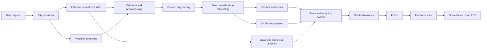

# Multiagent Epidemic Surveillance System

A research prototype for generating grounded epidemiological surveillance reports from weekly influenza time series. The system combines city-aware data collection, interpretable short-term forecasting, structured analytical context construction, role-separated LLM generation, and evaluator-based quality control.

The project is designed for scientific experimentation in epidemic surveillance, AI4Science workflows, and grounded text generation. It is **not** a clinical product and must not be used as a substitute for expert epidemiological assessment.

## Contents

- [Overview](#overview)
- [Key features](#key-features)
- [System architecture](#system-architecture)
- [Repository structure](#repository-structure)
- [Installation](#installation)
- [Local LLM setup](#local-llm-setup)
- [Quick start](#quick-start)
- [Typical usage](#typical-usage)
- [Generated artifacts](#generated-artifacts)
- [Configuration](#configuration)
- [Evaluation](#evaluation)
- [Data and privacy](#data-and-privacy)
- [Troubleshooting](#troubleshooting)
- [Limitations](#limitations)
- [Roadmap](#roadmap)
- [Citation](#citation)
- [License](#license)

## Overview

Epidemiological surveillance systems produce quantitative observations, short-term forecasts, uncertainty estimates, and model explanations. These outputs are useful but difficult to interpret directly: decision support requires a concise analytical report that preserves numerical evidence, uncertainty, and limitations.

This repository implements a notebook-based research pipeline that turns influenza surveillance data into a structured surveillance report. The core idea is **grounded text generation**: language-model agents generate report sections only from deterministic analytical evidence prepared before generation. Forecast values, intervals, model-quality metrics, wave-comparison summaries, age-group indicators, and SHAP-based feature-importance summaries are computed by the analytical pipeline and then passed to the LLM layer as a structured analytical context.

The current implementation focuses on influenza surveillance in Russian cities and generates report text in Russian. The repository documentation is written in English to make the project easier to inspect and reuse.

## Key features

- **City-aware data preparation**: natural-language city requests can be resolved to supported city codes.
- **Influenza incidence forecasting**: the main target is weekly incidence per 10,000 population (`inc_per_10k`).
- **Direct multi-horizon forecasting**: separate models are trained for forecast horizons `h = 1, 2, 3, 4`.
- **Weather covariates**: meteorological features, including temperature, are integrated into the forecasting dataset.
- **Prediction intervals**: lower and upper bounds are produced for short-term forecasts.
- **SHAP interpretation**: feature-attribution summaries are exported for report generation.
- **Structured analytical context**: deterministic analytical outputs are assembled into section-ready context slices.
- **Role-separated LLM generation**: section Narrators, an Editor, and Evaluators are used as separate roles.
- **Semantic quality gate**: numeric and factual reliability are treated as primary constraints.
- **PDF report rendering**: successful report runs can be rendered as a formatted surveillance report.

## System architecture



The LLM layer is intentionally separated from numerical computation. The models write around already computed evidence; they are not expected to calculate forecasts, derive metrics, or invent missing values.

## Repository structure

Recommended public repository layout:

```text
.
├── README.md
├── LICENSE
├── pyproject.toml
├── poetry.lock
├── Makefile
├── .gitignore
├── model_complex/
│   ├── epid_data/              # data access utilities
│   ├── calibration/            # calibration and forecasting utilities
│   ├── models/                 # model interfaces and model classes
│   └── utils/                  # shared helper objects
├── plot_module/                # plotting utilities from the base package
├── notebooks/
│   └── epidemic_surveillance_pipeline.ipynb
├── data/
│   ├── spb/
│   ├── samara/
│   ├── samara_day/
│   └── chelyabinsk/
├── results_csv/                # generated; ignored by Git
├── reports/                    # generated PDFs; ignored by Git
└── docs/
    └── figures/                # optional diagrams and screenshots
```

The main research workflow is currently notebook-centric. For a public repository, use a stable notebook name such as:

```text
notebooks/epidemic_surveillance_pipeline.ipynb
```

Avoid committing machine-specific paths, temporary experimental notebooks, private credentials, large generated archives, or local PDF outputs.

## Installation

### Requirements

- Python `>=3.10,<3.13`
- Poetry
- Jupyter Notebook or JupyterLab
- Ollama or another OpenAI-compatible local LLM backend, if report generation is required

### Clone and install

```bash
git clone https://github.com/<your-username>/<your-repository>.git
cd <your-repository>
poetry install --with dev
```

Register the Poetry environment as a Jupyter kernel:

```bash
poetry run python -m ipykernel install --user \
  --name epidemic-surveillance \
  --display-name "epidemic-surveillance"
```

### Dependency note

The original base package contains the core epidemiological data and modeling utilities. The full surveillance-report notebook additionally uses reporting, plotting, and interpretation packages. Make sure the following packages are available in the environment:

```text
numpy
pandas
scikit-learn
openpyxl
requests
matplotlib
scipy
shap
reportlab
pyyaml
ipykernel
ipywidgets
```

If your `pyproject.toml` does not yet include the full notebook dependencies, add them before running the complete pipeline:

```bash
poetry add matplotlib scipy shap reportlab pyyaml
poetry add --group dev ipykernel ipywidgets
```

### Developer tools

```bash
make install
make set_autoformatting
```

The repository uses `black`, `isort`, `flake8`, and `pre-commit` for basic formatting and static checks.

## Local LLM setup

The report-generation layer can use a local LLM through an OpenAI-compatible Ollama endpoint.

Start Ollama:

```bash
ollama serve
```

Install or select local models that are available in your Ollama installation. The experiments used compact local models for generation and a separate evaluator model for judging generated text. Replace the model names below with the exact names returned by `ollama list` on your machine:

```bash
ollama list
```

Linux/macOS environment variables:

```bash
export LLM_BACKEND=ollama
export OLLAMA_MODEL=qwen3.5:9b
export DEFAULT_REQUEST_TIMEOUT_SEC=180

export EVAL_LLM_BACKEND=ollama
export EVAL_OLLAMA_MODEL=gemma3:12b
export EVAL_REQUEST_TIMEOUT_SEC=600
```

Windows PowerShell:

```powershell
$env:LLM_BACKEND = "ollama"
$env:OLLAMA_MODEL = "qwen3.5:9b"
$env:DEFAULT_REQUEST_TIMEOUT_SEC = "180"

$env:EVAL_LLM_BACKEND = "ollama"
$env:EVAL_OLLAMA_MODEL = "gemma3:12b"
$env:EVAL_REQUEST_TIMEOUT_SEC = "600"
```

## Quick start

1. Open the main notebook:

   ```text
   notebooks/epidemic_surveillance_pipeline.ipynb
   ```

2. Make repository-root detection portable. If the notebook is inside `notebooks/`, use:

   ```python
   from pathlib import Path

   REPO_ROOT = Path("..").resolve()
   ```

   If the notebook is in the repository root, use:

   ```python
   from pathlib import Path

   REPO_ROOT = Path(".").resolve()
   ```

   Do not commit absolute local paths such as `C:\Users\...`.

3. Select the city request and optional end date:

   ```python
   CITY_QUERY = "Хочу данные по Питеру"
   END_DATE = None
   ```

4. Run the notebook sections in order:

   ```text
   Data preparation
   Forecasting and SHAP analysis
   Structured analytical context construction
   Multiagent report generation
   Evaluation
   PDF rendering
   ```

5. Run the main generation helper:

   ```python
   bundle_b, bundle_e = run_be_pair_for_model("qwen3.5:9b", backend="ollama")
   ```

6. Select the registered run and render the report PDF.

Generated CSV files are written to `results_csv/`. Generated reports should be written to `reports/` or another ignored output directory.

## Typical usage

### Run data preparation from a natural-language query

```python
city_data = prepare_city_pipeline_data_from_query(
    "Хочу посмотреть данные по Петербургу",
    end_date=None,
    interactive=True,
)
```

### Run data preparation from an explicit city code

```python
city_data = prepare_city_pipeline_data_from_code("spb", end_date=None)
```

### Run the full city pipeline

```python
result = run_full_pipeline("spb")
```

Multiple cities can be processed as a list:

```python
result = run_full_pipeline(["spb", "moscow", "novosibirsk"])
```

### Run forecasting and interpretation

```python
forecast_result = run_influenza_forecast_pipeline(
    df=city_data["merged_df"],
    H=4,
    test_weeks=52,
    temp_cols=["temp_mean"],
)
```

### Generate and evaluate the surveillance report

```python
bundle_b, bundle_e = run_be_pair_for_model("qwen3.5:9b", backend="ollama")
```

The first object contains the base section-level generation result. The second object contains the edited result with evaluator outputs and report artifacts.

## Supported city inputs

The notebook contains a city registry with 67 entries, including:

```text
russia
spb
moscow
novosibirsk
samara
chelyabinsk
kazan
yekaterinburg
nizhny_novgorod
vladivostok
```

The city-resolution agent can map natural-language requests such as `Питер`, `Санкт-Петербург`, or `Load data for Moscow` to internal city codes. For reproducible experiments, prefer explicit city codes.

## Generated artifacts

The analytical pipeline exports deterministic artifacts used by the generation layer:

| Artifact | Meaning |
|---|---|
| `feature_list.csv` | Feature names used by the forecasting models |
| `forecast_next_4w.csv` | Four-week point forecasts and prediction intervals |
| `history_plus_forecast_40.csv` | Last historical observations combined with the forecast horizon |
| `metrics_summary.csv` | Model-quality metrics by forecast horizon |
| `shap_global_importance.csv` | Global SHAP feature-importance summary |
| `shap_local_values.csv` | Local SHAP values for selected observations |
| `shap_worst_cases.csv` | Difficult-case interpretation artifacts |
| `test_predictions.csv` | Test-window predictions and ground truth |
| `model_registry.json` | Model metadata and forecasting setup |

The report-generation layer can also export:

| Artifact | Meaning |
|---|---|
| report JSON/dictionary | Generated section text, metadata, and evaluator results |
| PDF report | Final formatted surveillance report |
| evaluation summary | Numeric, factual, language-quality, and aggregate scores |

Generated artifacts should usually be excluded from version control unless they are small, stable examples used for documentation.

## Configuration

| Parameter | Meaning | Example / default |
|---|---|---|
| `CITY_QUERY` | Natural-language city request | `"Хочу данные по Питеру"` |
| `END_DATE` | Last date used in the data window | `None` |
| `target_col` | Forecast target | `inc_per_10k` |
| `H` | Forecast horizon length | `4` |
| `test_weeks` | Evaluation window length | `52` |
| `LLM_BACKEND` | LLM backend type | `ollama` |
| `OLLAMA_MODEL` | Narrator/editor model | `qwen3.5:9b` |
| `DEFAULT_REQUEST_TIMEOUT_SEC` | Narrator/editor request timeout | `180` |
| `EVAL_LLM_BACKEND` | Evaluator backend type | `ollama` |
| `EVAL_OLLAMA_MODEL` | Evaluator judge model | `gemma3:12b` |
| `EVAL_REQUEST_TIMEOUT_SEC` | Evaluator request timeout | `600` |

## Evaluation

The evaluator suite is designed to distinguish semantic reliability from surface-level fluency.

Default evaluators:

```text
numeric
factual
tautology
grammar
orthotypography
style
```

Optional diagnostic evaluators:

```text
logic
water
```

The final score uses a semantic gate: serious numeric or factual failures cannot be compensated for by grammar, spelling, or style. This prevents a fluent but unsupported report from receiving an inflated quality score.

The evaluator layer checks, among other things:

- whether reported numbers match the structured analytical context;
- whether temporal and causal claims are supported by evidence;
- whether uncertainty and limitations are preserved;
- whether the text is readable and not unnecessarily repetitive;
- whether Russian-language grammar and formatting are acceptable.

## Data and privacy

The repository may include small local example datasets under `data/`. The full pipeline can also retrieve or combine additional surveillance and weather inputs.

General rules before publishing:

- Do not commit private credentials, API tokens, or authentication parameters.
- Do not commit non-public raw surveillance data unless redistribution is permitted.
- Put local secrets in `.env` or another untracked configuration file.
- Keep generated reports, temporary CSV files, archives, and large intermediate outputs outside Git.

Recommended `.gitignore` additions:

```gitignore
# Local secrets
.env
*.env

# Generated analytical outputs
results_csv/
reports/
*.pdf
*.zip

# Notebook checkpoints
.ipynb_checkpoints/

# Local OS files
.DS_Store
Thumbs.db
```

## Troubleshooting

### `FileNotFoundError: model_complex`

The notebook cannot resolve the repository root. Replace absolute paths with a portable root:

```python
REPO_ROOT = Path("..").resolve()  # notebook inside notebooks/
```

or:

```python
REPO_ROOT = Path(".").resolve()   # notebook in repository root
```

### Ollama connection errors

Check that Ollama is running and that the selected model exists locally:

```bash
ollama serve
ollama list
```

Then update `OLLAMA_MODEL` and `EVAL_OLLAMA_MODEL` to match the names shown by `ollama list`.

### `No JSON object found in model output`

The local model did not follow the required JSON contract. Use a stronger model, reduce the prompt payload, increase the timeout, or rerun only the affected generation section.

### Missing PDF fonts or broken Cyrillic text

Install a Unicode font such as DejaVu Sans, Arial, or Liberation Sans. The PDF renderer attempts to register Cyrillic-compatible fonts automatically, but system font availability differs across operating systems.

### Very slow generation

Local LLM generation can be slow on CPU or integrated GPUs. Use a smaller model, reduce context size, disable optional diagnostics, or run only the selected city and model configuration.

### SHAP computation is slow

Reduce the number of background samples or run SHAP only for the selected model and horizon needed for the report.

## Limitations

- The project is a research prototype, not a production surveillance platform.
- Generated text requires expert review before operational use.
- Evaluator scores are useful diagnostics but may not fully match expert judgment.
- Local LLM outputs can vary by model, quantization, hardware, and decoding settings.
- Validation across more cities, seasons, and outbreak regimes is still required.
- The current implementation is notebook-centric and should be modularized for long-term maintenance.

## Roadmap

- Refactor notebook code into reusable Python modules.
- Add a command-line interface for city selection, forecasting, report generation, and PDF rendering.
- Add unit tests for data loading, feature engineering, forecasting, context construction, and evaluator contracts.
- Add small example reports and figures for documentation.
- Add continuous integration for formatting, linting, and smoke tests.
- Extend validation to more cities, seasons, and epidemiological regimes.
- Add clearer model cards for generation and evaluator LLMs.

## Citation

If you use this repository in academic work, cite it as:

```bibtex
@misc{lazutov2026multiagent_epidemic_surveillance,
  title  = {Multiagent Epidemic Surveillance System Based on Large Language Models, Early Warning Signals and Interpretable Forecasting},
  author = {Lazutov, Mark Yurievich},
  year   = {2026},
  note   = {Research prototype for grounded epidemic surveillance-report generation}
}
```

## License

This project is distributed under the terms specified in the [`LICENSE`](LICENSE) file.

## Acknowledgements

This project was developed as part of a research workflow on grounded text generation for epidemic surveillance. It combines interpretable forecasting, structured analytical context construction, local LLM generation, and evaluator-based assessment of generated reports.
