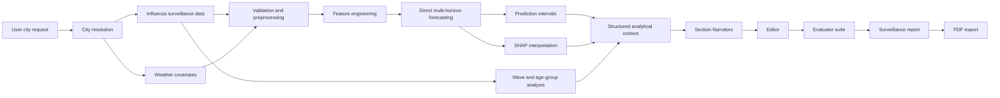

# Multiagent Epidemic Surveillance System

Grounded epidemic surveillance reporting with interpretable forecasting, structured analytical context, local LLM agents, and evaluator-based quality control.

This repository contains a reproducible research system that transforms weekly influenza surveillance data into evidence-grounded surveillance reports. The system combines epidemiological time-series preparation, weather-aware short-term forecasting, SHAP-based interpretation, structured analytical context construction, section-level report generation, editorial refinement, automated evaluation, and PDF rendering.

The project is designed for research in AI4Science, epidemic surveillance, interpretable forecasting, and grounded text generation. It is not a medical device and must not be used as a substitute for expert epidemiological assessment.

## Table of contents

- [System overview](#system-overview)
- [Core capabilities](#core-capabilities)
- [Architecture](#architecture)
- [Repository layout](#repository-layout)
- [Installation](#installation)
- [Local LLM backend](#local-llm-backend)
- [Quick start](#quick-start)
- [Usage examples](#usage-examples)
- [Generated outputs](#generated-outputs)
- [Configuration](#configuration)
- [Evaluation](#evaluation)
- [Data policy](#data-policy)
- [Troubleshooting](#troubleshooting)
- [Limitations](#limitations)
- [Citation](#citation)
- [License](#license)

## System overview

Epidemiological surveillance produces observations, forecasts, uncertainty estimates, wave comparisons, age-group summaries, and model explanations. These analytical outputs are useful, but they are not automatically suitable for decision support. A surveillance report must be concise, interpretable, and faithful to the underlying numerical evidence.

This system addresses that problem through **grounded text generation**. The language-model layer does not calculate epidemiological indicators or invent missing values. Instead, deterministic analytical artifacts are computed first and assembled into a **structured analytical context**. Section-level LLM agents then generate report text only from the relevant context slices.

The target output is a structured surveillance report covering:

- current epidemiological situation;
- short-term forecast and risk interpretation;
- comparison with previous epidemic waves;
- age-group and seasonal patterns;
- model drivers and SHAP-based interpretation;
- model quality, limitations, and uncertainty.

## Core capabilities

- **City-aware data preparation**  
  Natural-language city requests are mapped to supported internal city codes.

- **Influenza incidence forecasting**  
  The main target variable is weekly influenza incidence per 10,000 population: `inc_per_10k`.

- **Direct multi-horizon forecasting**  
  The system trains separate forecasting models for horizons `h = 1, 2, 3, 4`.

- **Weather-aware feature engineering**  
  Meteorological covariates, lag features, rolling statistics, and seasonal features are integrated into the forecasting dataset.

- **Prediction intervals**  
  Quantile-based lower and upper forecast bounds are generated for short-term uncertainty reporting.

- **Model interpretation**  
  SHAP summaries are exported and transformed into report-ready explanatory evidence.

- **Structured analytical context**  
  Forecasts, metrics, SHAP values, wave summaries, age-group indicators, and model metadata are assembled into section-ready context slices.

- **Role-separated generation**  
  Dedicated Narrators generate individual report sections. An Editor improves readability while preserving numerical and factual content.

- **Automated evaluation**  
  Evaluators assess numeric accuracy, factual consistency, redundancy, grammar, orthotypography, and style.

- **PDF report rendering**  
  Successful report runs can be rendered into a formatted surveillance report.

## Architecture



The analytical layer and the language-model layer are separated by design. Forecast values, intervals, metrics, and explanatory signals are produced before text generation. The LLM agents operate as grounded report writers, not as numerical computation modules.

## Repository layout

```text
.
├── README.md
├── LICENSE
├── pyproject.toml
├── poetry.lock
├── Makefile
├── .gitignore
├── model_complex/
│   ├── epid_data/              # epidemiological data access utilities
│   ├── calibration/            # calibration and forecasting utilities
│   ├── models/                 # model interfaces and model classes
│   └── utils/                  # shared helper objects
├── plot_module/                # plotting utilities
├── notebooks/
│   └── multiagent_system_evaluation.ipynb
├── data/
│   ├── spb/
│   ├── samara/
│   ├── samara_day/
│   └── chelyabinsk/
├── results_csv/                # generated analytical artifacts
├── reports/                    # generated surveillance reports
└── docs/
    └── figures/                # diagrams, screenshots, and example figures
```

The primary execution interface is:

```text
notebooks/multiagent_system_evaluation.ipynb
```

Generated outputs under `results_csv/` and `reports/` are excluded from version control unless they are intentionally added as small documentation examples.

## Installation

### Requirements

- Python `>=3.10,<3.13`
- Poetry
- Jupyter Notebook or JupyterLab
- Ollama or another OpenAI-compatible local LLM backend for report generation

### Install the environment

```bash
poetry install --with dev
```

Register the Poetry environment as a Jupyter kernel:

```bash
poetry run python -m ipykernel install --user \
  --name epidemic-surveillance \
  --display-name "epidemic-surveillance"
```

Open the notebook and select the `epidemic-surveillance` kernel:

```text
notebooks/multiagent_system_evaluation.ipynb
```

### Dependencies used by the full workflow

The full pipeline uses the following main packages:

```text
numpy
pandas
scikit-learn
openpyxl
requests
matplotlib
scipy
shap
reportlab
pyyaml
ipykernel
ipywidgets
```

If any full-pipeline dependency is missing from the environment, add it with Poetry:

```bash
poetry add matplotlib scipy shap reportlab pyyaml
poetry add --group dev ipykernel ipywidgets
```

### Development tools

```bash
make install
make set_autoformatting
```

The repository uses `black`, `isort`, `flake8`, and `pre-commit` for formatting and basic static checks.

## Local LLM backend

The report-generation layer can run through Ollama using an OpenAI-compatible local endpoint.

Start Ollama:

```bash
ollama serve
```

Check available models:

```bash
ollama list
```

Set generation and evaluation models.

Linux/macOS:

```bash
export LLM_BACKEND=ollama
export OLLAMA_URL=http://localhost:11434
export OLLAMA_MODEL=qwen3.5:9b
export DEFAULT_REQUEST_TIMEOUT_SEC=180

export EVAL_LLM_BACKEND=ollama
export EVAL_OLLAMA_MODEL=gemma3:12b
export EVAL_REQUEST_TIMEOUT_SEC=600
```

Windows PowerShell:

```powershell
$env:LLM_BACKEND = "ollama"
$env:OLLAMA_URL = "http://localhost:11434"
$env:OLLAMA_MODEL = "qwen3.5:9b"
$env:DEFAULT_REQUEST_TIMEOUT_SEC = "180"

$env:EVAL_LLM_BACKEND = "ollama"
$env:EVAL_OLLAMA_MODEL = "gemma3:12b"
$env:EVAL_REQUEST_TIMEOUT_SEC = "600"
```

The model names must match the names returned by `ollama list` on the local machine.

## Quick start

1. Install the environment:

   ```bash
   poetry install --with dev
   ```

2. Start the local LLM backend:

   ```bash
   ollama serve
   ```

3. Open the main notebook:

   ```text
   notebooks/multiagent_system_evaluation.ipynb
   ```

4. Select a city request and an optional end date:

   ```python
   CITY_QUERY = "Хочу данные по Питеру"
   END_DATE = None
   ```

5. Run the workflow sections in order:

   ```text
   Data preparation
   Forecasting and interpretation
   Structured analytical context construction
   Section-level report generation
   Editorial refinement
   Evaluation
   PDF rendering
   ```

6. Run the base generation and editor refinement pair:

   ```python
   bundle_b, bundle_e = run_be_pair_for_model("qwen3.5:9b", backend="ollama")
   ```

7. Render successful report runs to PDF:

   ```python
   pdf_paths = render_all_bulletin_pdfs(
       run_bundles=REPORT_RUNS,
       out_dir="reports",
       forecast_plot_path=FORECAST_PLOT_PATH,
       wave_plot_path=WAVE_PLOT_PATH,
   )
   ```

## Usage examples

### Prepare data from a natural-language city request

```python
city_data = prepare_city_pipeline_data_from_query(
    "Хочу посмотреть данные по Петербургу",
    end_date=None,
    interactive=True,
)
```

### Prepare data from an explicit city code

```python
city_data = prepare_city_pipeline_data_from_code("spb", end_date=None)
```

### Run the city data pipeline

```python
city_pipeline_data = run_full_pipeline("spb", end_date=None)
```

Multiple cities can be processed in one call:

```python
city_pipeline_data = run_full_pipeline(
    ["spb", "samara", "chelyabinsk"],
    end_date=None,
)
```

### Run forecasting and interpretation

```python
forecast_result = run_influenza_forecast_pipeline(
    df=city_data["df"],
    H=4,
    test_weeks=52,
    temp_cols=["temp_mean"],
    target_col="inc_per_10k",
    save_dir="results_csv",
    plot=True,
)
```

### Generate a grounded surveillance report

```python
bundle_b, bundle_e = run_be_pair_for_model(
    "qwen3.5:9b",
    backend="ollama",
)
```

`bundle_b` contains the base section-level generation result. `bundle_e` contains the editor-refined result and evaluator outputs when the base generation succeeds.

## Generated outputs

### Analytical artifacts

| Artifact | Description |
|---|---|
| `feature_list.csv` | Features used by the forecasting models |
| `forecast_next_4w.csv` | Four-week point forecasts and prediction intervals |
| `history_plus_forecast_40.csv` | Recent history combined with the forecast horizon |
| `metrics_summary.csv` | Forecast-quality metrics by horizon |
| `shap_global_importance.csv` | Global SHAP feature-importance summary |
| `shap_local_values.csv` | Local SHAP values for selected observations |
| `shap_worst_cases.csv` | Difficult-case interpretation artifacts |
| `test_predictions.csv` | Test-window predictions and observed values |
| `model_registry.json` | Forecasting setup and model metadata |

### Report artifacts

| Artifact | Description |
|---|---|
| Report dictionary / JSON | Generated section text, metadata, and evaluator results |
| Evaluation summary | Numeric, factual, language-quality, and aggregate scores |
| PDF report | Final formatted surveillance report |

## Configuration

| Parameter | Description | Default / example |
|---|---|---|
| `CITY_QUERY` | Natural-language city request | `"Хочу данные по Питеру"` |
| `END_DATE` | Last date included in the data window | `None` |
| `target_col` | Forecast target variable | `inc_per_10k` |
| `H` | Forecast horizon length | `4` |
| `test_weeks` | Holdout evaluation window | `52` |
| `LLM_BACKEND` | Generation backend | `ollama` |
| `OLLAMA_URL` | Ollama endpoint | `http://localhost:11434` |
| `OLLAMA_MODEL` | Narrator/editor model | `qwen3.5:9b` |
| `DEFAULT_REQUEST_TIMEOUT_SEC` | Narrator/editor timeout | `180` |
| `EVAL_LLM_BACKEND` | Evaluator backend | `ollama` |
| `EVAL_OLLAMA_MODEL` | Evaluator judge model | `gemma3:12b` |
| `EVAL_REQUEST_TIMEOUT_SEC` | Evaluator timeout | `600` |
| `NARRATOR_PROMPT_MODE` | Prompt profile | `research` |

## Evaluation

The evaluator suite separates semantic reliability from surface-level text quality.

Default evaluators:

```text
numeric
factual
tautology
grammar
orthotypography
style
```

Optional diagnostic evaluators:

```text
logic
water
```

The evaluation layer checks whether:

- reported numbers match the structured analytical context;
- forecast horizons, dates, units, and intervals are preserved;
- factual claims are supported by the available evidence;
- uncertainty and limitations are communicated without overstatement;
- the text is readable and not unnecessarily repetitive;
- Russian grammar, spelling, and formatting are acceptable.

A semantic gate prevents fluent but numerically or factually unreliable reports from receiving inflated aggregate scores.

## Data policy

The repository may include small example datasets under `data/`. External surveillance and weather inputs must be used in accordance with their source terms.

Do not commit:

- private credentials;
- API tokens;
- non-public raw surveillance data without redistribution permission;
- large generated archives;
- temporary reports and intermediate CSV outputs.

Use environment variables or an untracked `.env` file for local configuration.

Recommended generated-output exclusions:

```gitignore
.env
*.env
results_csv/
reports/
*.pdf
*.zip
.ipynb_checkpoints/
.DS_Store
Thumbs.db
```

## Troubleshooting

### Ollama connection error

Check that Ollama is running and that the selected model is installed:

```bash
ollama serve
ollama list
```

Then update `OLLAMA_MODEL` and `EVAL_OLLAMA_MODEL` to match local model names.

### `No JSON object found in model output`

The selected LLM did not follow the expected JSON contract. Use a stronger model, reduce the prompt payload, increase the timeout, or rerun the affected section.

### Slow generation

Local LLM inference may be slow on CPU-only machines or integrated GPUs. Use a smaller model, reduce context size, disable optional diagnostics, or run the workflow for a single city and one model configuration.

### SHAP computation is slow

Reduce the number of background samples or run SHAP only for the selected model and forecast horizon required by the report.

### Broken Cyrillic text in PDF output

Install a Unicode font with Cyrillic support, such as DejaVu Sans, Arial, or Liberation Sans. The PDF renderer registers available Cyrillic-compatible fonts, but font availability differs across operating systems.

## Limitations

- The system is research software, not an operational clinical or public-health decision system.
- Generated surveillance reports require expert review before any real-world use.
- Evaluator scores are diagnostic signals and may not fully match expert judgment.
- Local LLM outputs can vary by model, quantization, hardware, and decoding settings.
- Forecast quality depends on data completeness, seasonality, city coverage, and covariate availability.
- External validation across additional cities, seasons, and epidemic regimes is required.

## Citation

If you use this repository in academic work, cite it as:

```bibtex
@misc{lazutov2026multiagent_epidemic_surveillance,
  title  = {Multiagent Epidemic Surveillance System Based on Large Language Models, Early Warning Signals and Interpretable Forecasting},
  author = {Lazutov, Mark Yurievich},
  year   = {2026},
  note   = {Research software for grounded epidemic surveillance-report generation}
}
```

## License

This project is distributed under the terms specified in the [`LICENSE`](LICENSE) file.
